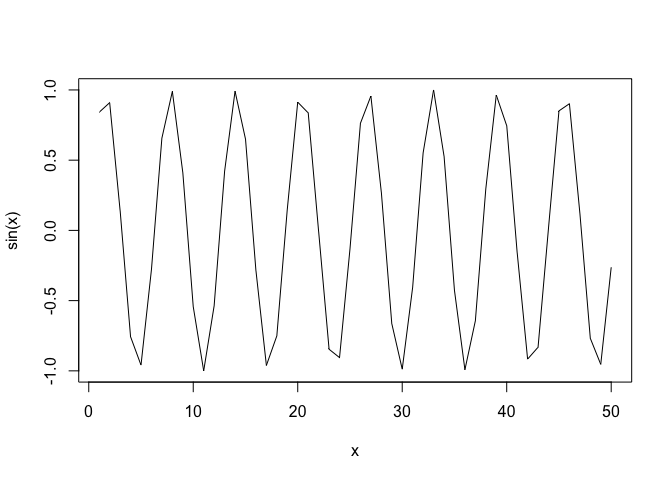

# Intro to R
Marielle Samonte
2025-04-10

``` r
# My first R script
x <- 1:50
plot(x, sin(x))
```


``` r
plot(x, sin(x), typ="l")
```



``` r
plot(x, sin(x), typ="l", col="pink", lwd=3, xlab="Silly x axis", ylab="Sensible y axis")
```


