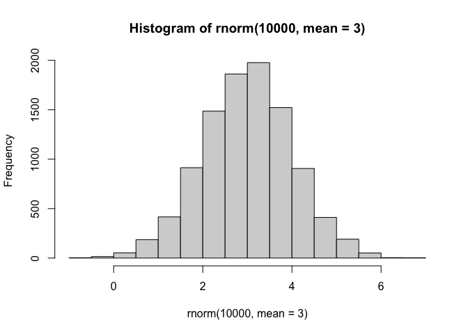
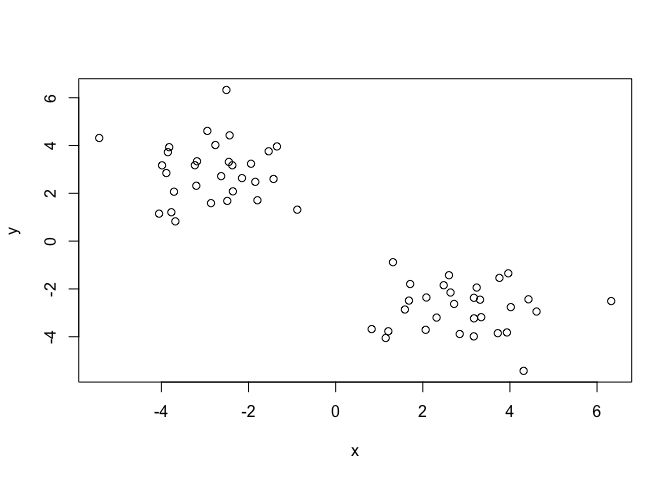
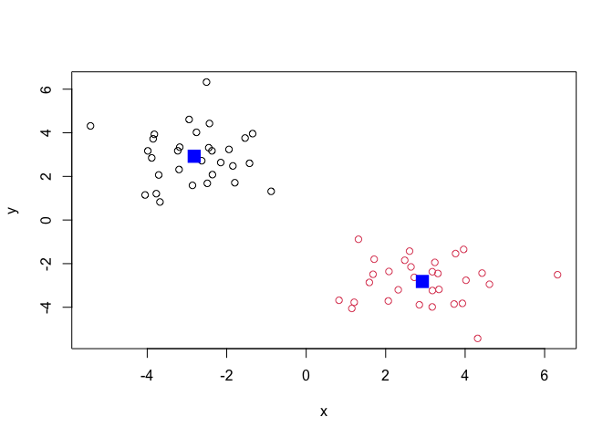
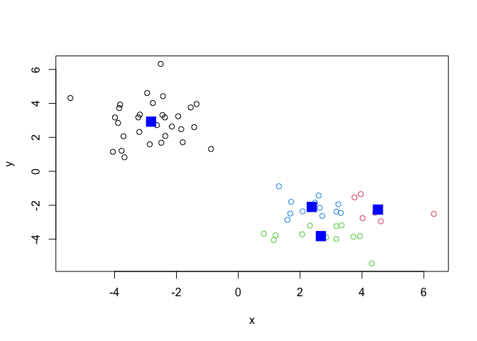
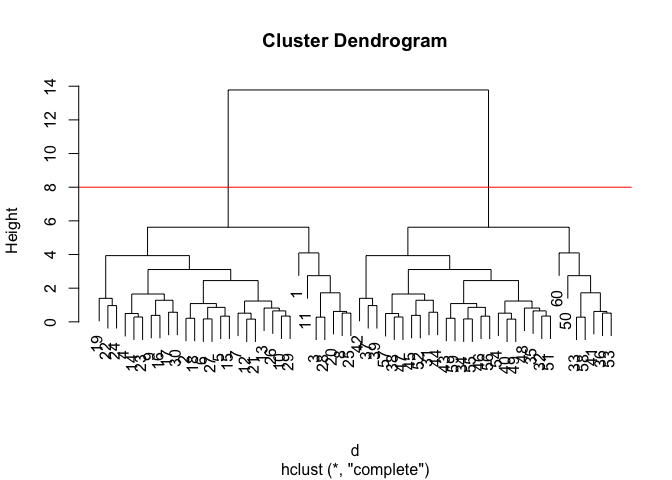
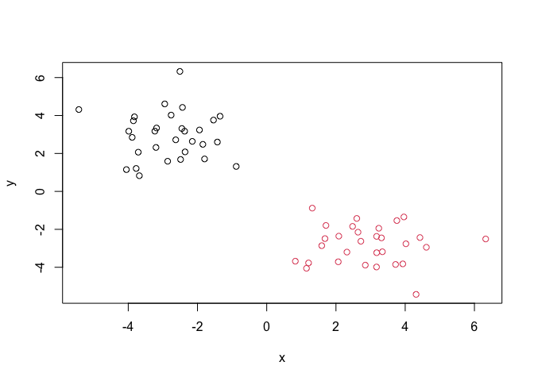
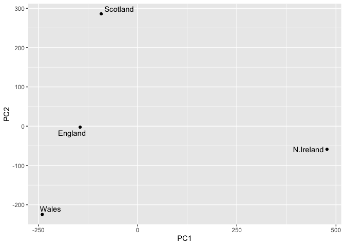

# Class 7: Machine Learning 1
Marielle Samonte (A16861951)

- [Clustering](#clustering)
- [K-means](#k-means)
  - [Hierarchical Clustering](#hierarchical-clustering)
- [Principal Component Analysis
  (PCA)](#principal-component-analysis-pca)
  - [Data import](#data-import)
  - [PCA to the rescue](#pca-to-the-rescue)
  - [Interpreting PCA results](#interpreting-pca-results)

Today we will explore unsupervised machine learning methods starting
with clustering and dimensionality reduction.

## Clustering

To start let’s make up some data to cluster where we know what the
answer should be. The `rnorm()` function will help us here.

``` r
hist ( rnorm(10000, mean = 3) )
```



Return 30 numbers centered on -3

``` r
tmp <- c( rnorm(30, mean = -3),
   rnorm(30, mean = 3) )

x <- cbind(x=tmp, y=rev(tmp))

x
```

                   x          y
     [1,] -5.4277098  4.3148939
     [2,] -3.8510585  3.7225254
     [3,] -1.5375269  3.7590837
     [4,] -3.6795436  0.8266040
     [5,] -3.9849512  3.1713266
     [6,] -3.2315042  3.1757281
     [7,] -1.9426662  3.2371407
     [8,] -2.7613685  4.0209945
     [9,] -2.8614521  1.5895440
    [10,] -1.8448810  2.4805004
    [11,] -2.5078320  6.3250919
    [12,] -2.3716926  3.1736857
    [13,] -2.6283273  2.7189840
    [14,] -4.0532229  1.1490890
    [15,] -3.8865433  2.8479485
    [16,] -2.4883620  1.6824761
    [17,] -3.7108683  2.0665219
    [18,] -3.8209829  3.9311930
    [19,] -0.8812508  1.3155668
    [20,] -2.9457979  4.6113104
    [21,] -2.4514530  3.3147934
    [22,] -1.7957433  1.7102652
    [23,] -3.7715590  1.2087847
    [24,] -1.4256563  2.6014259
    [25,] -2.4340948  4.4262369
    [26,] -2.3587936  2.0825377
    [27,] -3.1821450  3.3412329
    [28,] -1.3473144  3.9622984
    [29,] -2.1499750  2.6369758
    [30,] -3.1989166  2.3167580
    [31,]  2.3167580 -3.1989166
    [32,]  2.6369758 -2.1499750
    [33,]  3.9622984 -1.3473144
    [34,]  3.3412329 -3.1821450
    [35,]  2.0825377 -2.3587936
    [36,]  4.4262369 -2.4340948
    [37,]  2.6014259 -1.4256563
    [38,]  1.2087847 -3.7715590
    [39,]  1.7102652 -1.7957433
    [40,]  3.3147934 -2.4514530
    [41,]  4.6113104 -2.9457979
    [42,]  1.3155668 -0.8812508
    [43,]  3.9311930 -3.8209829
    [44,]  2.0665219 -3.7108683
    [45,]  1.6824761 -2.4883620
    [46,]  2.8479485 -3.8865433
    [47,]  1.1490890 -4.0532229
    [48,]  2.7189840 -2.6283273
    [49,]  3.1736857 -2.3716926
    [50,]  6.3250919 -2.5078320
    [51,]  2.4805004 -1.8448810
    [52,]  1.5895440 -2.8614521
    [53,]  4.0209945 -2.7613685
    [54,]  3.2371407 -1.9426662
    [55,]  3.1757281 -3.2315042
    [56,]  3.1713266 -3.9849512
    [57,]  0.8266040 -3.6795436
    [58,]  3.7590837 -1.5375269
    [59,]  3.7225254 -3.8510585
    [60,]  4.3148939 -5.4277098

Make a plot of `x`

``` r
plot(x)
```



## K-means

The main function in “base” R for K-means clustering is called
`kmeans()`:

``` r
km <- kmeans(x, centers = 2)
km
```

    K-means clustering with 2 clusters of sizes 30, 30

    Cluster means:
              x         y
    1 -2.817773  2.924051
    2  2.924051 -2.817773

    Clustering vector:
     [1] 1 1 1 1 1 1 1 1 1 1 1 1 1 1 1 1 1 1 1 1 1 1 1 1 1 1 1 1 1 1 2 2 2 2 2 2 2 2
    [39] 2 2 2 2 2 2 2 2 2 2 2 2 2 2 2 2 2 2 2 2 2 2

    Within cluster sum of squares by cluster:
    [1] 73.4263 73.4263
     (between_SS / total_SS =  87.1 %)

    Available components:

    [1] "cluster"      "centers"      "totss"        "withinss"     "tot.withinss"
    [6] "betweenss"    "size"         "iter"         "ifault"      

The `kmeans()` function return a “list” with 9 components. You can see
the named components of any list with the `attributes()` function.

``` r
attributes(km)
```

    $names
    [1] "cluster"      "centers"      "totss"        "withinss"     "tot.withinss"
    [6] "betweenss"    "size"         "iter"         "ifault"      

    $class
    [1] "kmeans"

> Q. How many points are in each cluster?

``` r
km$size
```

    [1] 30 30

> Q. Cluster assignment/membership vector?

``` r
km$cluster
```

     [1] 1 1 1 1 1 1 1 1 1 1 1 1 1 1 1 1 1 1 1 1 1 1 1 1 1 1 1 1 1 1 2 2 2 2 2 2 2 2
    [39] 2 2 2 2 2 2 2 2 2 2 2 2 2 2 2 2 2 2 2 2 2 2

> Q. Cluster centers?

``` r
km$centers
```

              x         y
    1 -2.817773  2.924051
    2  2.924051 -2.817773

> Q. Make a plot of our `kmeans()` results showing cluster assignment
> using different colors for each cluster/group of points and cluster
> centers in blue.

``` r
plot(x, col= km$cluster)
points(km$centers, col="blue",pch=15, cex=2)
```



> Q. Run `kmeans()` again on `x` and this cluster into 4 groups/clusters
> and plot the same result figure as above.

``` r
km4 <- kmeans(x, centers = 4)
plot(x, col= km4$cluster)
points(km4$centers, col="blue",pch=15, cex=2)
```



> **key-point**: K-means clustering is super popular but can be
> miss-used. One big limitation is that it can impose a clustering
> pattern on your data even if clear natural grouping dont exist -
> i.e. it does what you tell it to do in terms of `centers`.

### Hierarchical Clustering

The main function in “base” R for Hierarchical Clustering is called
`hclust()`.

You can’t just pass our dataset as is into `hcluster()` you must give
“distance matrix” as input. We can get this from the `dist()` function
in R.

``` r
d <- dist(x)
hc <- hclust(d)
hc
```


    Call:
    hclust(d = d)

    Cluster method   : complete 
    Distance         : euclidean 
    Number of objects: 60 

The results of `hclust()` don’t have a useful `print()` method but do
have a special `plot()` method.

``` r
plot(hc)
abline(h=8, col="red")
```



To get our main cluster assignment (membership vector) we need to “cut”
the tree at the big goal posts…

``` r
grps <- cutree(hc, h=8)
grps
```

     [1] 1 1 1 1 1 1 1 1 1 1 1 1 1 1 1 1 1 1 1 1 1 1 1 1 1 1 1 1 1 1 2 2 2 2 2 2 2 2
    [39] 2 2 2 2 2 2 2 2 2 2 2 2 2 2 2 2 2 2 2 2 2 2

``` r
table(grps)
```

    grps
     1  2 
    30 30 

``` r
plot(x, col=grps)
```



Hierarchical clustering is distinct in that the dendrogram (tree figure)
can reveal the potential grouping in your data (unlike K-means)

## Principal Component Analysis (PCA)

PCA is a common and highly useful dimensionality reduction technique
used in many fields - particularly bioinformatics

Here we will analyze some data from the UK on food consumption.

### Data import

``` r
url <- "https://tinyurl.com/UK-foods"
x <- read.csv(url)
```

``` r
rownames(x) <- x[,1]
x <- x[,1]
head(x)
```

    [1] "Cheese"         "Carcass_meat "  "Other_meat "    "Fish"          
    [5] "Fats_and_oils " "Sugars"        

``` r
x <- read.csv(url, row.names = 1)
head(x)
```

                   England Wales Scotland N.Ireland
    Cheese             105   103      103        66
    Carcass_meat       245   227      242       267
    Other_meat         685   803      750       586
    Fish               147   160      122        93
    Fats_and_oils      193   235      184       209
    Sugars             156   175      147       139

``` r
barplot(as.matrix(x), beside=F, col=rainbow(nrow(x)))
```


One conventional plot that can be useful is called a “paris” plot.

``` r
pairs(x, col=rainbow(nrow(x)), pch=16)
```


### PCA to the rescue

The main function in base R for PCA is called `prcomp()`

``` r
pca <- prcomp ( t(x) )
summary(pca)
```

    Importance of components:
                                PC1      PC2      PC3       PC4
    Standard deviation     324.1502 212.7478 73.87622 3.176e-14
    Proportion of Variance   0.6744   0.2905  0.03503 0.000e+00
    Cumulative Proportion    0.6744   0.9650  1.00000 1.000e+00

The `prcomp()` function returns a list object of our results with five
attributes/components

``` r
attributes(pca)
```

    $names
    [1] "sdev"     "rotation" "center"   "scale"    "x"       

    $class
    [1] "prcomp"

The two main “results” in here are `pca$x` and `pca$rotation` The first
of these (`pca$x`) contains the scores of the data on the new PC axis -
we use these to make our “PCA plot”.

``` r
pca$x
```

                     PC1         PC2        PC3           PC4
    England   -144.99315   -2.532999 105.768945 -4.894696e-14
    Wales     -240.52915 -224.646925 -56.475555  5.700024e-13
    Scotland   -91.86934  286.081786 -44.415495 -7.460785e-13
    N.Ireland  477.39164  -58.901862  -4.877895  2.321303e-13

``` r
library(ggplot2)
library(ggrepel)

# Make a plot of pca$x with PC1 vs PC2
ggplot(pca$x) + 
  aes(PC1, PC2, label = rownames(pca$x)) +
  geom_point() +
  geom_text_repel()
```



The plot maps the relationship between the countries and the major
principal components reducing the variation in the data to a two
dimensional plot.

The second major result is contained in the `pca$rotation` object or
component. Let’s plot this to see what PCA is picking up…

``` r
ggplot(pca$rotation) +
  aes(PC1, rownames(pca$rotation)) +
  geom_col()
```


### Interpreting PCA results

The plot above shows food groups with positive and negative loading
scores which push the countries to the left or right side of the plot.
Observing the two plots above, N. Ireland consumes more fresh potatoes
than the other UK countries, while fresh fruit and alcoholic drinks are
more consumed by Wales, England, and Scotland than N. Ireland.
