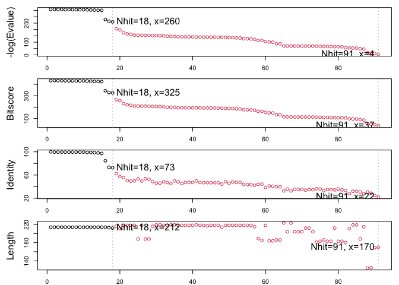
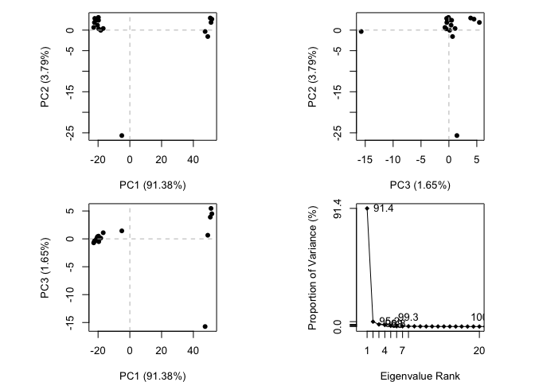
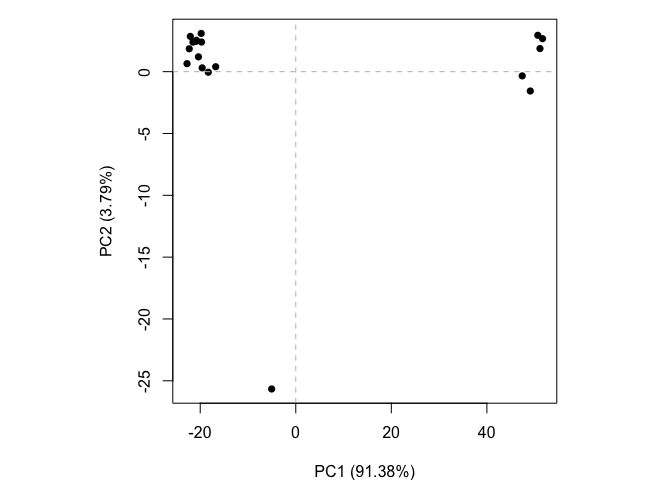

# Class 11: Comparative structure analysis
Marielle Samonte (A16861951)

Load up the packages we will need for analysis of protein structure
sets.

``` r
library(bio3d)
```

We will analyze the ADK starting with a single ADK database accession
code: “1ake_A”

``` r
id <- "1ake_A"
aa <- get.seq(id)
```

    Fetching... Please wait
    Failed. Retry 1.... Done.

``` r
aa
```

                 1        .         .         .         .         .         60 
    pdb|1AKE|A   MRIILLGAPGAGKGTQAQFIMEKYGIPQISTGDMLRAAVKSGSELGKQAKDIMDAGKLVT
                 1        .         .         .         .         .         60 

                61        .         .         .         .         .         120 
    pdb|1AKE|A   DELVIALVKERIAQEDCRNGFLLDGFPRTIPQADAMKEAGINVDYVLEFDVPDELIVDRI
                61        .         .         .         .         .         120 

               121        .         .         .         .         .         180 
    pdb|1AKE|A   VGRRVHAPSGRVYHVKFNPPKVEGKDDVTGEELTTRKDDQEETVRKRLVEYHQMTAPLIG
               121        .         .         .         .         .         180 

               181        .         .         .   214 
    pdb|1AKE|A   YYSKEAEAGNTKYAKVDGTKPVAEVRADLEKILG
               181        .         .         .   214 

    Call:
      read.fasta(file = outfile)

    Class:
      fasta

    Alignment dimensions:
      1 sequence rows; 214 position columns (214 non-gap, 0 gap) 

    + attr: id, ali, call

> Q. Q13. How many amino acids are in this sequence, i.e. how long is
> this sequence?

214 amino acids

Now we can search the PDB database to find all related enteries.

``` r
blast <- blast.pdb(aa)
```

     Searching ... please wait (updates every 5 seconds) RID = 43SC6AZ0013 
     .
     Reporting 91 hits

``` r
attributes(blast)
```

    $names
    [1] "hit.tbl" "raw"     "url"    

    $class
    [1] "blast"

``` r
head(blast$hit.tbl)
```

           queryid subjectids identity alignmentlength mismatches gapopens q.start
    1 Query_538519     1AKE_A  100.000             214          0        0       1
    2 Query_538519     8BQF_A   99.533             214          1        0       1
    3 Query_538519     4X8M_A   99.533             214          1        0       1
    4 Query_538519     6S36_A   99.533             214          1        0       1
    5 Query_538519     8Q2B_A   99.533             214          1        0       1
    6 Query_538519     8RJ9_A   99.533             214          1        0       1
      q.end s.start s.end    evalue bitscore positives mlog.evalue pdb.id    acc
    1   214       1   214 1.67e-156      432    100.00    358.6905 1AKE_A 1AKE_A
    2   214      21   234 2.73e-156      433    100.00    358.1990 8BQF_A 8BQF_A
    3   214       1   214 2.98e-156      432    100.00    358.1114 4X8M_A 4X8M_A
    4   214       1   214 4.38e-156      432    100.00    357.7262 6S36_A 6S36_A
    5   214       1   214 1.16e-155      431     99.53    356.7523 8Q2B_A 8Q2B_A
    6   214       1   214 1.16e-155      431     99.53    356.7523 8RJ9_A 8RJ9_A

Make a little summary figure of these results:

``` r
hits <- plot(blast)
```

      * Possible cutoff values:    260 3 
                Yielding Nhits:    18 91 

      * Chosen cutoff value of:    260 
                Yielding Nhits:    18 



Our “top hits” i.e. the most similar enteries in the database are:

``` r
hits$pdb.id
```

     [1] "1AKE_A" "8BQF_A" "4X8M_A" "6S36_A" "8Q2B_A" "8RJ9_A" "6RZE_A" "4X8H_A"
     [9] "3HPR_A" "1E4V_A" "5EJE_A" "1E4Y_A" "3X2S_A" "6HAP_A" "6HAM_A" "8PVW_A"
    [17] "4K46_A" "4NP6_A"

``` r
# Download releated PDB files
files <- get.pdb(hits$pdb.id, path="pdbs", split=TRUE, gzip=TRUE)
```


      |                                                                            
      |                                                                      |   0%
      |                                                                            
      |====                                                                  |   6%
      |                                                                            
      |========                                                              |  11%
      |                                                                            
      |============                                                          |  17%
      |                                                                            
      |================                                                      |  22%
      |                                                                            
      |===================                                                   |  28%
      |                                                                            
      |=======================                                               |  33%
      |                                                                            
      |===========================                                           |  39%
      |                                                                            
      |===============================                                       |  44%
      |                                                                            
      |===================================                                   |  50%
      |                                                                            
      |=======================================                               |  56%
      |                                                                            
      |===========================================                           |  61%
      |                                                                            
      |===============================================                       |  67%
      |                                                                            
      |===================================================                   |  72%
      |                                                                            
      |======================================================                |  78%
      |                                                                            
      |==========================================================            |  83%
      |                                                                            
      |==============================================================        |  89%
      |                                                                            
      |==================================================================    |  94%
      |                                                                            
      |======================================================================| 100%

Align and superimpose all these structures

``` r
# Align releated PDBs
pdbs <- pdbaln(files, fit = TRUE, exefile="msa")
```

    Reading PDB files:
    pdbs/split_chain/1AKE_A.pdb
    pdbs/split_chain/8BQF_A.pdb
    pdbs/split_chain/4X8M_A.pdb
    pdbs/split_chain/6S36_A.pdb
    pdbs/split_chain/8Q2B_A.pdb
    pdbs/split_chain/8RJ9_A.pdb
    pdbs/split_chain/6RZE_A.pdb
    pdbs/split_chain/4X8H_A.pdb
    pdbs/split_chain/3HPR_A.pdb
    pdbs/split_chain/1E4V_A.pdb
    pdbs/split_chain/5EJE_A.pdb
    pdbs/split_chain/1E4Y_A.pdb
    pdbs/split_chain/3X2S_A.pdb
    pdbs/split_chain/6HAP_A.pdb
    pdbs/split_chain/6HAM_A.pdb
    pdbs/split_chain/8PVW_A.pdb
    pdbs/split_chain/4K46_A.pdb
    pdbs/split_chain/4NP6_A.pdb
       PDB has ALT records, taking A only, rm.alt=TRUE
    .   PDB has ALT records, taking A only, rm.alt=TRUE
    ..   PDB has ALT records, taking A only, rm.alt=TRUE
    .   PDB has ALT records, taking A only, rm.alt=TRUE
    .   PDB has ALT records, taking A only, rm.alt=TRUE
    .   PDB has ALT records, taking A only, rm.alt=TRUE
    ..   PDB has ALT records, taking A only, rm.alt=TRUE
    ..   PDB has ALT records, taking A only, rm.alt=TRUE
    ....   PDB has ALT records, taking A only, rm.alt=TRUE
    .   PDB has ALT records, taking A only, rm.alt=TRUE
    .   PDB has ALT records, taking A only, rm.alt=TRUE
    ..

    Extracting sequences

    pdb/seq: 1   name: pdbs/split_chain/1AKE_A.pdb 
       PDB has ALT records, taking A only, rm.alt=TRUE
    pdb/seq: 2   name: pdbs/split_chain/8BQF_A.pdb 
       PDB has ALT records, taking A only, rm.alt=TRUE
    pdb/seq: 3   name: pdbs/split_chain/4X8M_A.pdb 
    pdb/seq: 4   name: pdbs/split_chain/6S36_A.pdb 
       PDB has ALT records, taking A only, rm.alt=TRUE
    pdb/seq: 5   name: pdbs/split_chain/8Q2B_A.pdb 
       PDB has ALT records, taking A only, rm.alt=TRUE
    pdb/seq: 6   name: pdbs/split_chain/8RJ9_A.pdb 
       PDB has ALT records, taking A only, rm.alt=TRUE
    pdb/seq: 7   name: pdbs/split_chain/6RZE_A.pdb 
       PDB has ALT records, taking A only, rm.alt=TRUE
    pdb/seq: 8   name: pdbs/split_chain/4X8H_A.pdb 
    pdb/seq: 9   name: pdbs/split_chain/3HPR_A.pdb 
       PDB has ALT records, taking A only, rm.alt=TRUE
    pdb/seq: 10   name: pdbs/split_chain/1E4V_A.pdb 
    pdb/seq: 11   name: pdbs/split_chain/5EJE_A.pdb 
       PDB has ALT records, taking A only, rm.alt=TRUE
    pdb/seq: 12   name: pdbs/split_chain/1E4Y_A.pdb 
    pdb/seq: 13   name: pdbs/split_chain/3X2S_A.pdb 
    pdb/seq: 14   name: pdbs/split_chain/6HAP_A.pdb 
    pdb/seq: 15   name: pdbs/split_chain/6HAM_A.pdb 
       PDB has ALT records, taking A only, rm.alt=TRUE
    pdb/seq: 16   name: pdbs/split_chain/8PVW_A.pdb 
       PDB has ALT records, taking A only, rm.alt=TRUE
    pdb/seq: 17   name: pdbs/split_chain/4K46_A.pdb 
       PDB has ALT records, taking A only, rm.alt=TRUE
    pdb/seq: 18   name: pdbs/split_chain/4NP6_A.pdb 

Side-note:

``` r
library(bio3dview)

#view.pdbs(pdbs)
```

This is better but still difficult to see what is similar and different
in all these structures or indeed learn much about how this family
works.

Let’s try PCA:

``` r
pc <- pca(pdbs)
plot(pc)
```



``` r
plot(pc, pc.axes = 1:2)
```



``` r
#view.pca(pc)
```

Write a PDB “trajectory” for mol-star

``` r
mktrj(pc, file="pca_results.pdb")
```
